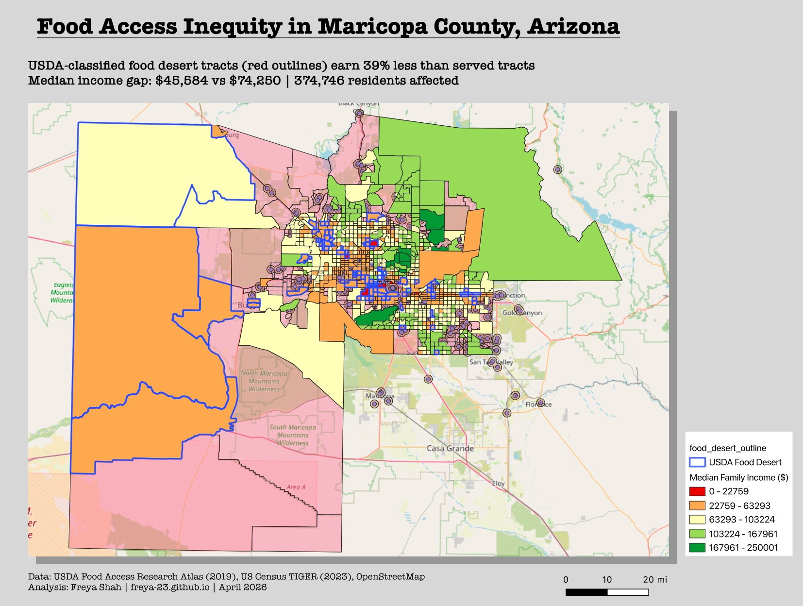
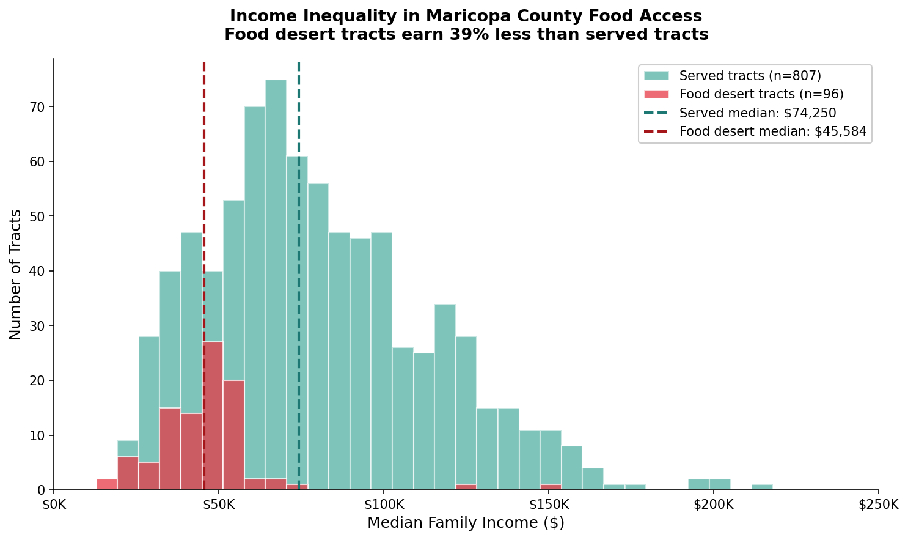

# Phoenix Food Access Inequity Analysis

Spatial analysis of grocery store access across 1,009 census tracts in Maricopa County, Arizona, revealing a strong correlation between food deserts and low-income neighborhoods.

Choropleth: tracts shaded by median family income (red = lowest, green = highest). Blue outlines mark USDA-classified food desert tracts.

---

## Headline Findings

| Metric | Food Desert | Served | Gap |
|---|---|---|---|
| Tracts | 97 | 816 | 10.6 percent of Maricopa tracts are food deserts |
| Median family income | $45,584 | $74,250 | **39 percent gap** |
| Median poverty rate | 25.2 percent | 10.0 percent | **2.5x higher** |
| Total population (2010) | 374,746 | 3,442,371 | — |

**358,946 urban Maricopa residents lack walkable grocery access.** 97 percent of food desert tracts in the county are urban — challenging the rural food desert stereotype and pointing to systemic urban inequality instead.

---

## Income Distribution

Food desert tracts cluster at the low end of income distribution; served tracts span up to $250K+.

---

## Methodology

1. **Data collection** — Scraped ~665 grocery stores for Maricopa County from OpenStreetMap (Overpass API); downloaded 2023 TIGER census tracts from US Census Bureau; downloaded USDA Food Access Research Atlas 2019.

2. **Spatial analysis in QGIS** — Reprojected layers to EPSG:26912 (UTM Zone 12N) for meter-based distance operations; built 1-mile (1609m) buffers around each grocery store and dissolved into a single served-area polygon; spatial join classified each tract as served or food desert.

3. **Income overlay** — Joined USDA Low-Income Low-Access (LILA) classification and median family income to tracts via zero-padded GEOIDs.

4. **Statistical comparison** — Computed income and poverty differentials and urban/rural breakdown between food desert and served tracts in Python.

---

## Tech Stack

QGIS 3.44 LTR, Python (Pandas, Matplotlib), GeoPackage, OpenStreetMap via Overpass Turbo, USDA Food Access Research Atlas 2019, US Census Bureau TIGER/Line 2023.

Coordinate systems: EPSG:4269 (NAD83, source) to EPSG:26912 (UTM Zone 12N, analysis).

---

## Limitations

- OSM grocery store coverage is uneven; convenience stores are conflated with full-service supermarkets
- USDA 2019 uses pre-2020 tract boundaries; ~10 percent of 2023 tracts do not match due to the 2020 redistricting redraw
- 1-mile walking distance is one accessibility definition; USDA stricter 0.5-mile urban threshold would flag more food deserts
- Income data is 2010-era from the USDA Atlas; current figures likely differ, though relative patterns across tracts typically persist

---

## Author

**Freya Shah** — MS Data Science, Analytics & Engineering, Arizona State University (May 2026)

Contact: freyash2321@gmail.com | Portfolio: freya-23.github.io | LinkedIn: linkedin.com/in/freya-shah-5a608623a
